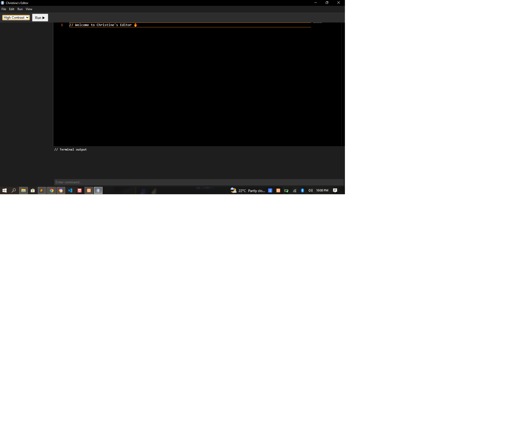

# Christine Editor

A lightweight and simple code editor built with Node.js for web developers.

## 🚀 Features

- Clean and simple interface
- Fast code editing
- Lightweight and easy to use
- Designed for HTML, CSS, and JavaScript development
- Easy installation on Windows

## 📥 Download

Download the latest version here:

https://github.com/simpandechristine-create/christine-editor/releases/latest

## 🖥 Installation

1. Download *Christine.Editor.Setup.1.0.0.exe*
2. Run the installer
3. Follow the installation instructions
4. Launch *Christine Editor*

## 🛠 Built With

- Node.js
- HTML
- CSS
- JavaScript

## 📷 Screenshot

## 👩‍💻 Author

*Christine Simpande*

## 📄 License

This project is licensed under the MIT License.

